# Free Open Scientific Equipment

Fermium LTD announces the free release of all scientific equipment designs under the terms of the MIT license. You are free to use them as you wish.

## Why?

Our small business is no longer competitive in this sector, and thus we've ceased production of this scientific equipment.

## What's Included

- Microwave Optics Kit:
  - [Microwave RX and TX](https://github.com/Fermium/ltk-mw-electronic): A pair of ultra-low-cost 10GHz microwave transmitters and receivers
  - [Microwave Kit Display](https://github.com/Fermium/frm-mw-display)
  - [Diode Detector](https://github.com/Fermium/frm-mw-diode-detector): A 10GHz diode detector for studying evanescent waves and wave propagation in waveguides
  - [Mechanics](https://github.com/Fermium/ltk-mw-mechanics) including:
    - [Transmitter and Receiver](https://github.com/Fermium/ltk-mw-mechanics/tree/master/transmitter%20and%20receiver) with rear protractor
    - [Structure](https://github.com/Fermium/ltk-mw-mechanics/tree/master/structure) with feet, rulers, center protractor, and center mount
    - [PCB Optics Components](https://github.com/Fermium/ltk-mw-mechanics/tree/master/pcbs): Mirrors, polarizers, photon-sieves, Fresnel zone plates
    - [Waveguides](https://github.com/Fermium/ltk-mw-mechanics/tree/master/accessories/waveguides)

- Hall Effect Apparatus:
  - [Electronics](https://github.com/Fermium/ltk-hall-electronics) for the 2015, 2017, and 2019 models
  - [2015 Firmware](https://github.com/Fermium/Hall-firmware)
  - [2017 Firmware](https://github.com/Fermium/hall-firmware-v2#hall-effect-apparatus-firmware---2017)

# ltk-mw-mechanics

Mechanical parts for the Microwave Optics Kit. Almost all mechanical designs are provided in Siemens NX format. All PCBs in Altium Designer format.

## Main unit

The main unit is defined in the folder [structure](ltk-mw-mechanics/structure) and it includes a center protractor, the joint, feet, rulers, device mount.

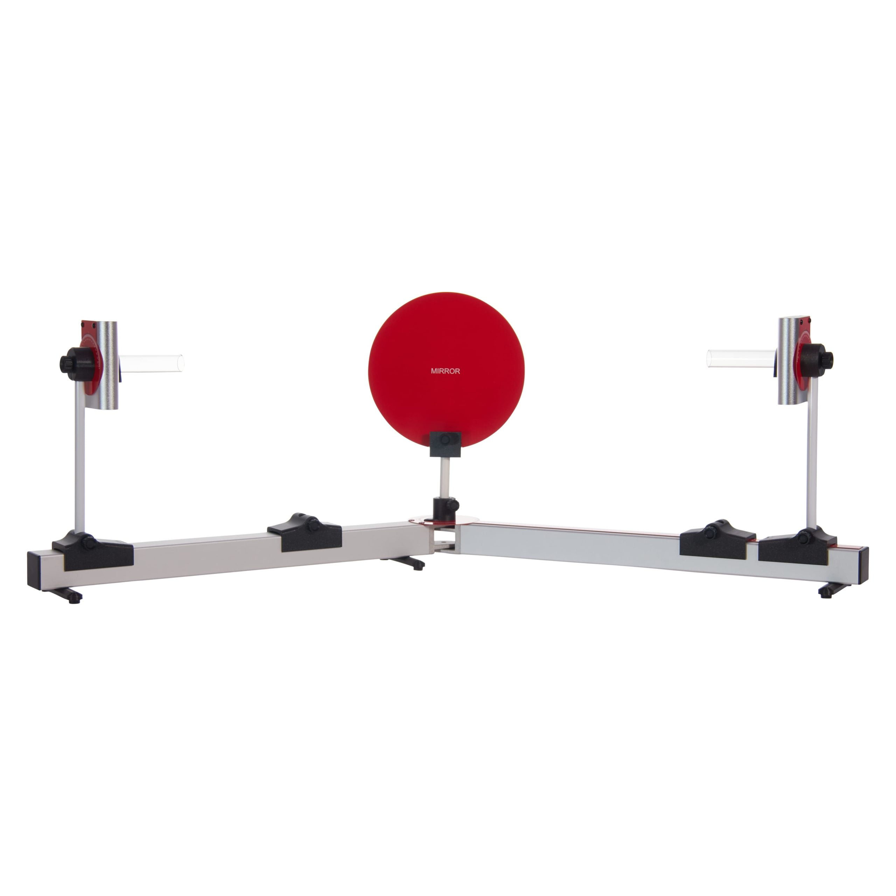
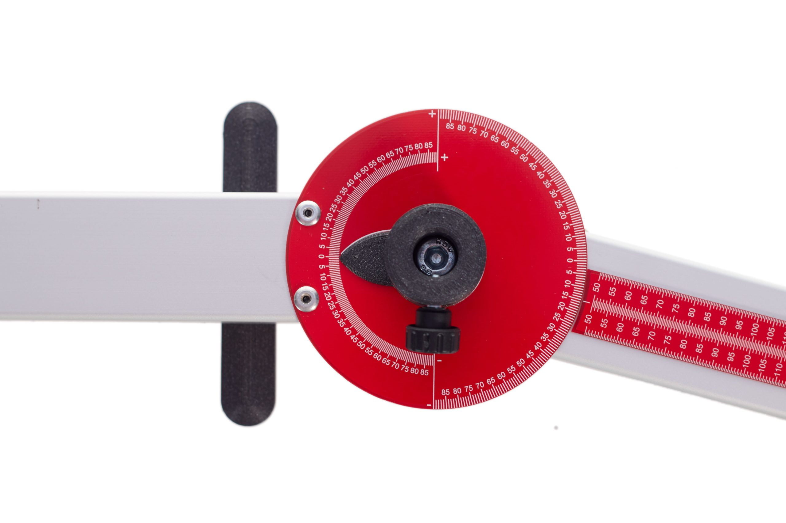

The protractors are under the folder pcbs.

## Optical components

Optical components are defined in the folder [pcbs](ltk-mw-mechanics/pcbs) and they include:

- [Double slot](ltk-mw-mechanics/pcbs/ltk_mw_double_slot.PcbDoc)
- [Fresnel zone plate](ltk-mw-mechanics/pcbs/ltk_mw_fresnel_plates.PcbDoc)
- [Mirror](ltk-mw-mechanics/pcbs/ltk-mw_mirror.PcbDoc)
- [Photon Sieve](ltk-mw-mechanics/pcbs/ltk-mw_photon_sieve.PcbDoc)
- [Polarizer](ltk-mw-mechanics/pcbs/ltk-mw_polarizer.PcbDoc)

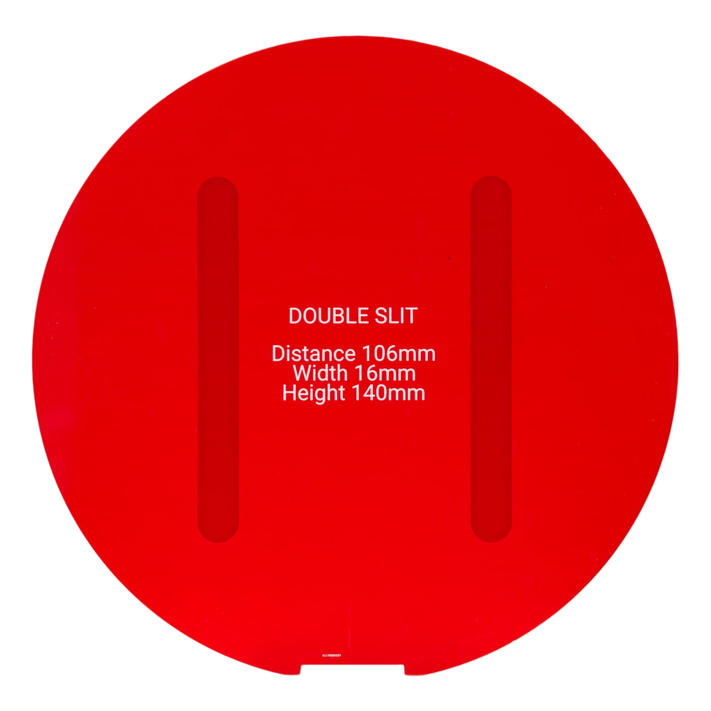
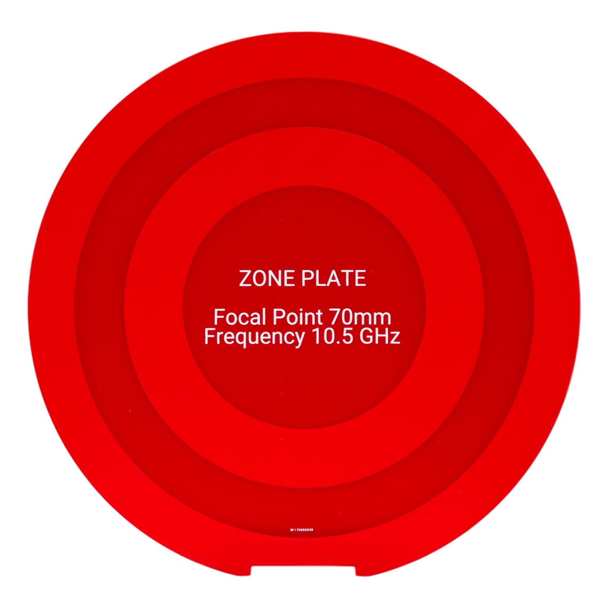
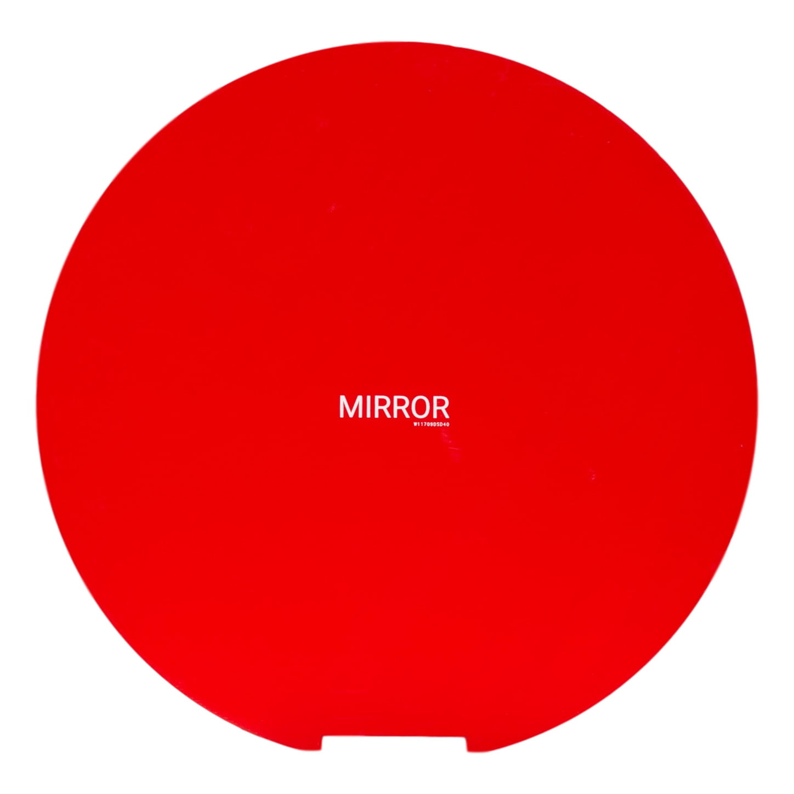
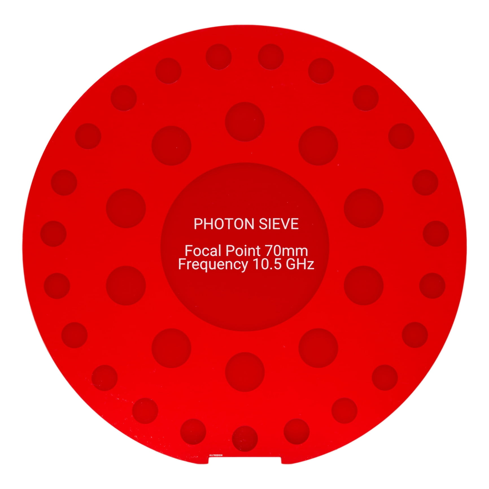
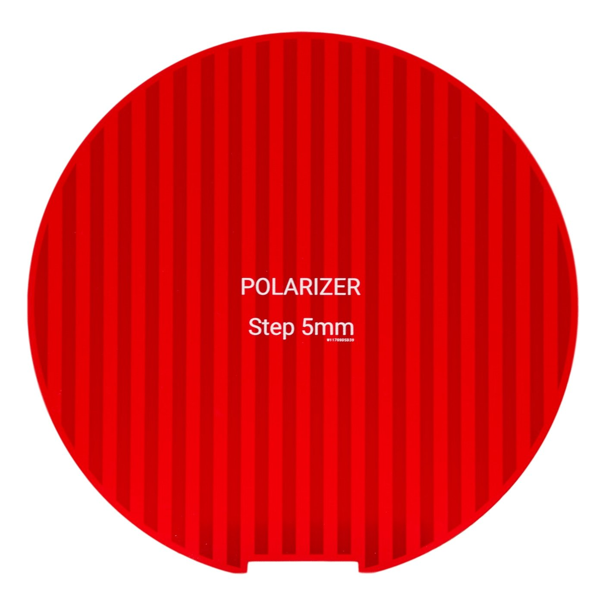

A classical fresnel lens is also included in another folder.

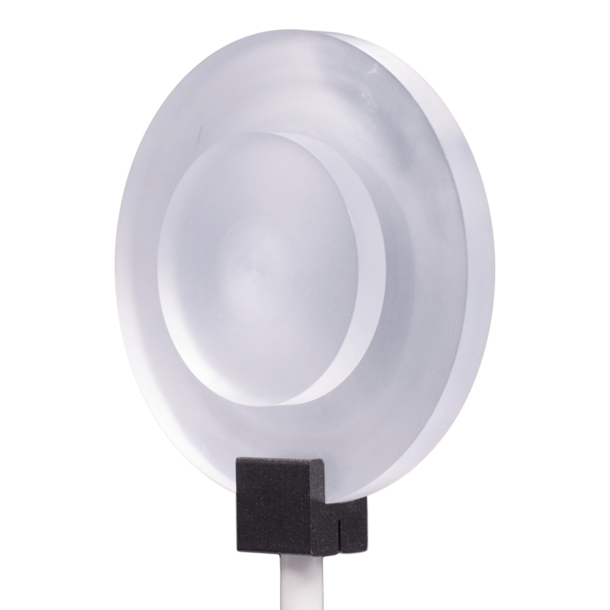

## RX and TX

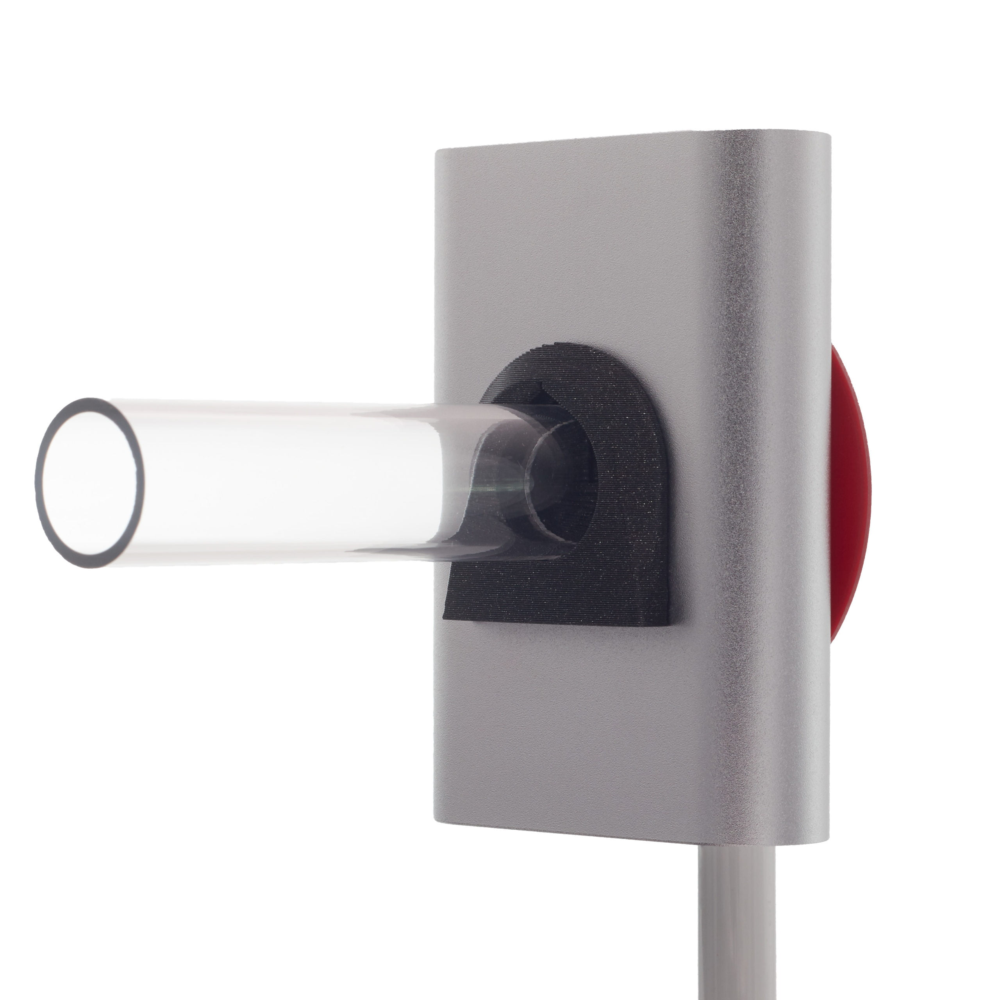
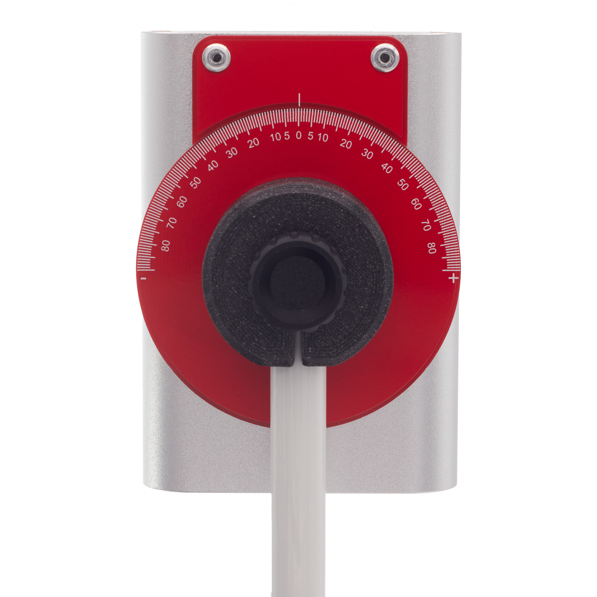

## Others

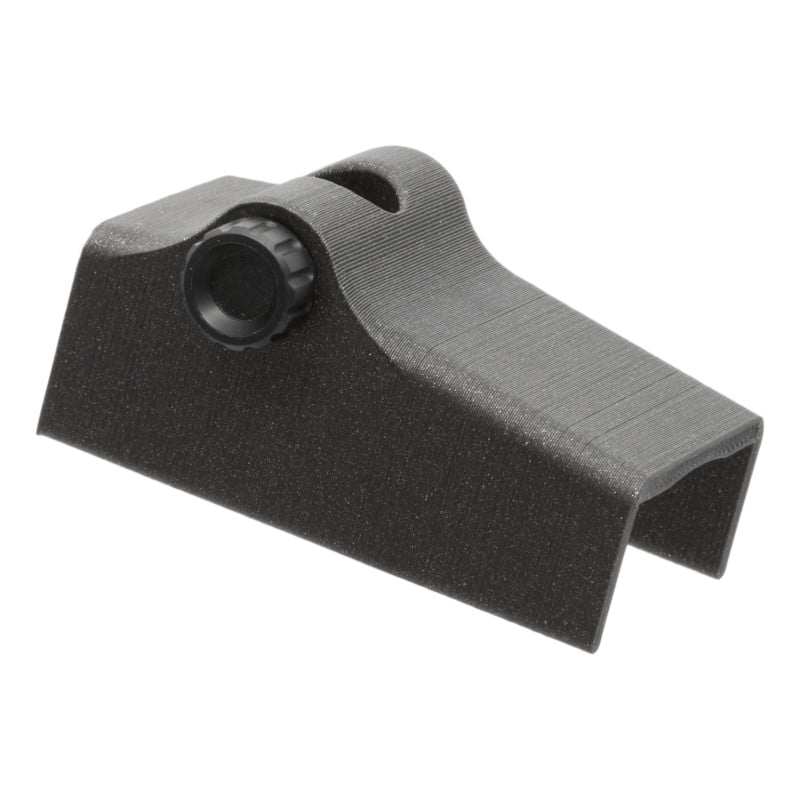

